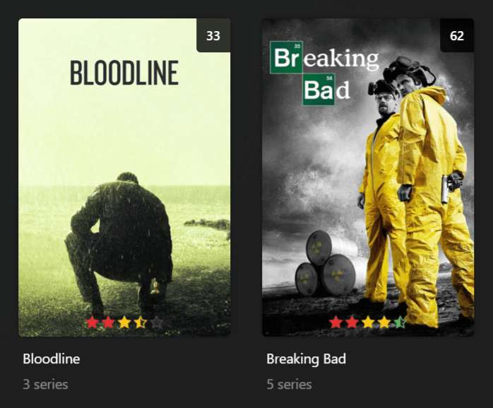
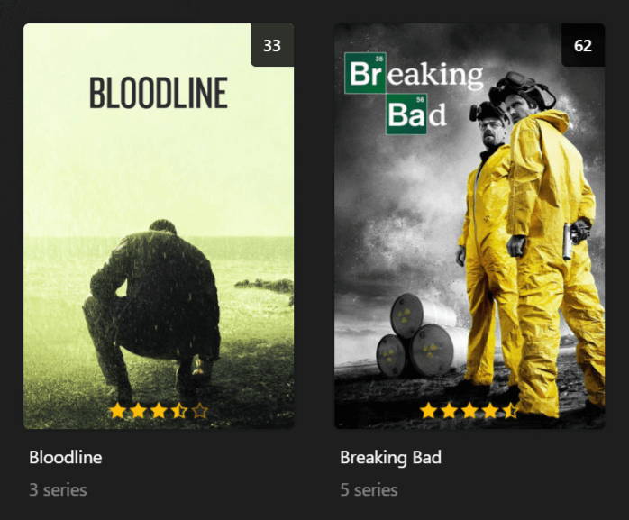
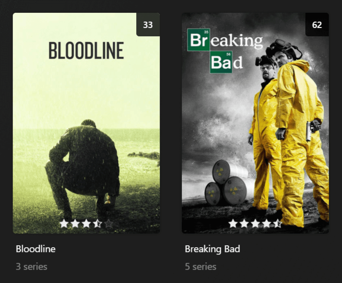

# kometa-star-ratings

Star Rating overlay for Kometa Shows and Movies

This will take the user rating, or audience rating, or critic rating (the first that has a value in that order) and overlay a star rating on the poster.

## Instructions

Copy this into the `kometa/config/` folder. Add it to the config and optionally add some `template_variables` to override the defaults -

```yaml
libraries:
  <name>: # Can be run on Shows or Movies
    overlay_files:
    - file: config/kometa-star-rating/star_rating.yml
    #   template_variables:
    #     icons: gold # color / *gold / white
    #     horizontal_offset: 0
    #     horizontal_align: center
    #     vertical_offset: 15
    #     vertical_align: bottom
```

## Icons

### `icons: color`



### `icons: gold` *(default)*



### `icons: white`


